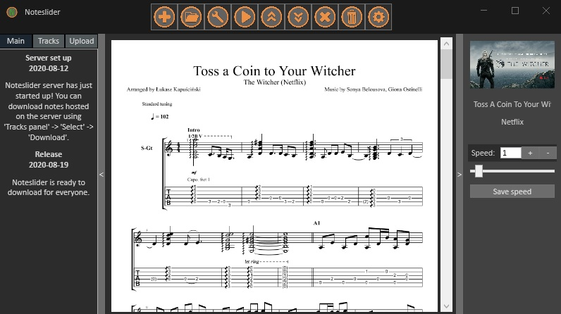

# Noteslider



## Introduction
Noteslider is an application to store notes (especially music sheets), load them and auto-slide.
When you play both hans on guitar you're not able to scroll down the screen by your computer mouse.
Noteslider allows you to compose track from assets - multiple files.
If you create the track you can load it and click play button. It will start to slide slowly.
You can modify speed using slider on the right side.

## Download
You can download the program, unzip it and open Noteslider.exe app.
<a href="www.google.com">

</a>

## Extensions
You can register your own file type to be interpreted by Noteslider.
To do so, you need to write three classes: Model, Converter and Renderer.
* Model represents that your asset consists of. (Should derive from Asset)
* Converter provides methods to serialize asset. (Should implements IBassetToAssetConvertable interface)
* Renderer defines how to render you concrete asset. (Should derive from AssetRenderer)

At the end you have to register new asset type in Main-CompositionRoot.

```csharp

    // use concrete asset for concrete extension
    AssetConverter.RegisterExtension<TextAsset>(".txt");

    // for concrete asset use concrete asset converter
    AssetConverter.RegisterConverter<TextAsset, TextAssetConverter>();

    // for concrete asset use concrete asset renderer
    AssetRendererFactory.RegisterRenderer<TextAsset, TextAssetRenderer>();

```